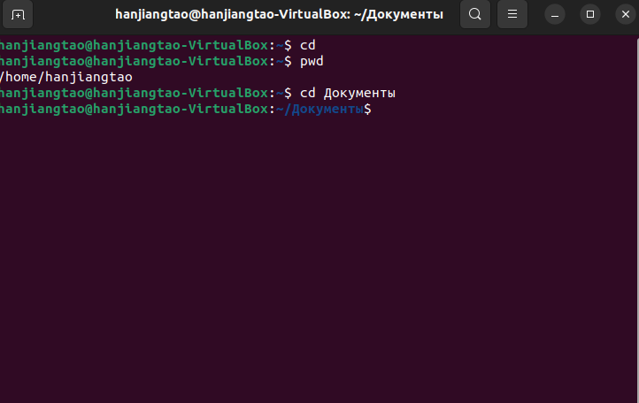
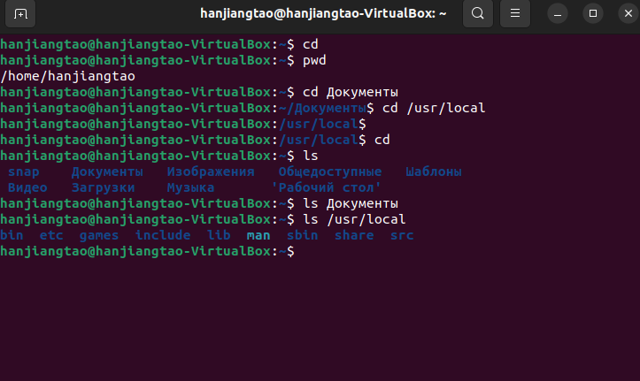
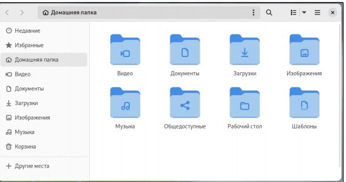
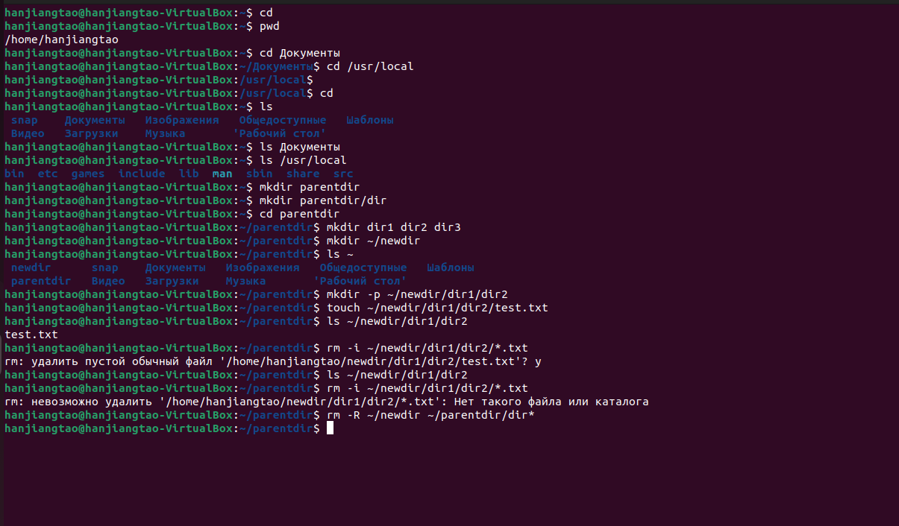
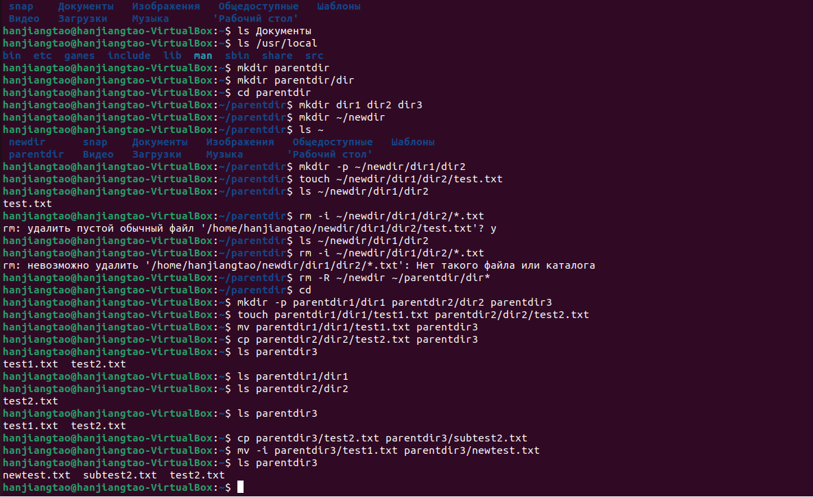
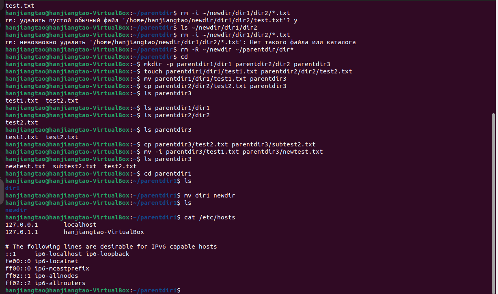

---
## Front matter
title: "Шаблон отчёта по лабораторной работе"
subtitle: "Простейший вариант"
author: "Хань Цзянтао"

## Generic otions
lang: ru-RU
toc-title: "Содержание"

## Bibliography
bibliography: bib/cite.bib
csl: pandoc/csl/gost-r-7-0-5-2008-numeric.csl

## Pdf output format
toc: true # Table of contents
toc-depth: 2
lof: true # List of figures
lot: true # List of tables
fontsize: 12pt
linestretch: 1.5
papersize: a4
documentclass: scrreprt
## I18n polyglossia
polyglossia-lang:
  name: russian
  options:
	- spelling=modern
	- babelshorthands=true
polyglossia-otherlangs:
  name: english
## I18n babel
babel-lang: russian
babel-otherlangs: english
## Fonts
mainfont: PT Serif
romanfont: PT Serif
sansfont: PT Sans
monofont: PT Mono
mainfontoptions: Ligatures=TeX
romanfontoptions: Ligatures=TeX
sansfontoptions: Ligatures=TeX,Scale=MatchLowercase
monofontoptions: Scale=MatchLowercase,Scale=0.9
## Biblatex
biblatex: true
biblio-style: "gost-numeric"
biblatexoptions:
  - parentracker=true
  - backend=biber
  - hyperref=auto
  - language=auto
  - autolang=other*
  - citestyle=gost-numeric
## Pandoc-crossref LaTeX customization
figureTitle: "Рис."
tableTitle: "Таблица"
listingTitle: "Листинг"
lofTitle: "Список иллюстраций"
lotTitle: "Список таблиц"
lolTitle: "Листинги"
## Misc options
indent: true
header-includes:
  - \usepackage{indentfirst}
  - \usepackage{float} # keep figures where there are in the text
  - \floatplacement{figure}{H} # keep figures where there are in the text
---

# Цель работы

Целью данной лабораторной работы является приобретение практических 

навыков работы с операционной системой Linux на уровне командной строки 

(организация файловой системы, навигация по файловой системе, создание и 

удаление файлов и директорий).

# Задание

1. Перемещение по файловой системе. 

2. Создание пустых файлов и каталогов. 

3. Перемещение и удаление файлов или каталогов. 

4. Команда cat: вывод содержимого файлов. 

# Теоретическое введение

Файловая система определяет способ организации, хранения и именования 

данных на носителях информации в компьютерах и представляет собой 

иерархическую структуру в виде вложенных друг в друга каталогов 

(директорий), содержащих все файлы. В ОС Linux каталог, который является 

“вершиной” файловой системы, называется корневым каталогом, 

обозначается символом **/** и содержит все остальные каталоги и файлы. В 

большинстве Linux-систем поддерживается стандарт иерархии файловой 

системы (Filesystem Hierarchy Standard, FHS), унифицирующий 

местонахождение файлов и каталогов. Это означает, что в корневом каталоге 

находятся только подкаталоги со стандартными именами и типами данных, 

которые могут попасть в тот или иной каталог. Так, в любой Linux-системе 

всегда есть каталоги /etc, /home, /usr/bin и т.п.

| Имя каталога | Описание каталога                                                                                                          |
|--------------|----------------------------------------------------------------------------------------------------------------------------|
| `/`          | Корневая директория, содержащая всю файловую                                                                               |
| `/bin `      | Основные системные утилиты, необходимые как в однопользовательском режиме, так и при обычной работе всем пользователям     |
| `/etc`       | Общесистемные конфигурационные файлы и файлы конфигурации установленных программ                                           |
| `/home`      | Содержит домашние директории пользователей, которые, в свою очередь, содержат персональные настройки и данные пользователя |
| `/media`     | Точки монтирования для сменных носителей                                                                                   |
| `/root`      | Домашняя директория пользователя  `root`                                                                                   |
| `/tmp`       | Временные файлы                                                                                                            |
| `/usr`       | Вторичная иерархия для данных пользователя                                                                                 |

Обратиться к файлу, расположенному в каком-то каталоге, можно указав путь 

к нему. Существует несколько видов путей к файлу: 

• **полный или абсолютный путь** — начинается от корня (/), образуется 

перечислением всех каталогов, разделённых прямым слешем (/), и 

завершается именем файла.

• **относительный путь** — так же как и полный путь, строится перечислением 

через (/) всех каталогов, но начинается от текущего каталога (каталога, в 

котором “находится” пользователь.

Таким образом, в Linux если имя объекта начинается с /, то системой это 

интерпретируется как полный путь, в любом другом случае — как 

относительный. В Linux любой пользователь имеет домашний каталог, 

который, как правило, имеет имя пользователя. В домашних каталогах 

хранятся документы и настройки пользователя. Для обозначения домашнего 

каталога используется знак тильды (~). При переходе из домашнего каталога 

знак тильды будет заменён на имя нового текущего каталога.

В операционной системе GNU Linux взаимодействие пользователя с 

системой обычно осуществляется с помощью командной строки посредством 

построчного ввода команд.

Первые задачи, которые приходится решать в любой системе это — работа с 

данными (обычно хранящимися в файлах) и управление работающими в 

системе программами (процессами). Для получения достаточно подробной 

информации по каждой из команд используйте команду **man**.

# Выполнение лабораторной работы

Описываются проведённые действия, в качестве иллюстрации даётся ссылка на иллюстрацию (рис. [-@fig:001]).

{#fig:001 width=70%}

# Выводы

**4.1 Перемещение по файловой системе**

Открываю терминал и убеждаюсь, что нахожусь в домашнем каталоге.

С помощью команды pwd узнаю полный путь к моему домашнему каталогу.

Перехожу в подкаталог Документы моего домашнего каталога, указав 

относительный путь.

Перехожу в каталог local – подкаталог usr корневого каталога, указав 

абсолютный путь к нему.

Использую комбинацию cd - для возвращения в последний посещённый 

каталог и попадаю в каталог Документы.

Использую комбинацию cd .. для перехода на один каталог выше по иерархии 

и попадаю в домашний катало

{#fig:001 width=70%}

{#fig:001 width=70%}

Вывожу список файлов моего домашнего каталога с помощью команды ls

Убеждаюсь в том, что список файлов, полученных с помощью команды ls, 

совпадает с файлами, отображающимися в графическом файловом 

менеджере.

{#fig:001 width=70%}

{#fig:001 width=70%}

Вывожу список файлов подкаталога Документы моего домашнего каталога, 

указав относительный путь, и узнаю, что список пуст.

Вывожу список файлов каталога /usr/local, указав абсолютный путь к нему

**4.2 Создание пустых файлов и каталогов**

Создаю в домашнем каталоге подкаталог с именем parentdir с помощью 

команды mkdir.

С помощью команды ls проверяю, что каталог создан.

Создаю подкаталог dir в каталоге parentdir, затем перемещаюсь в каталог 

parentdir и, задав несколько аргументов команде mkdir, создаю каталоги dir1, 

dir2 и dir3.

Создаю подкаталог newdir в домашнем каталоге, указав путь в явном виде, т.к 

нахожусь сейчас в каталоге parentdir.

Проверяю наличие каталога newdir в домашнем каталоге с помощью команды 

ls ~.

Создаю иерархическую цепочку подкаталогов newdir/dir1/dir2 в домашнем 

каталоге с помощью опции -p.

Создаю файл test.txt в каталоге ~/newdir/dir1/dir2 с помощью команды touch и 

Проверяю наличие файла с помощью команды.

{#fig:001 width=70%}

**4.3 Перемещение и удаление файлов или** 

**каталогов**

Запросив подтверждение на удаление каждого файла в текущем каталоге с 

помощью команды rm и опции -i, удаляю в подкаталоге /newdir/dir1/dir2/ все 

файлы с именами, заканчивающимися на .txt, и проверяю, выполнилась ли 

команда.

Рекурсивно удаляю из текущего каталога без запроса подтверждения на 

удаление каталог newdir, а также файлы, чьи имена начинаются с dir в 

каталоге parentdir, затем проверяю, что команда выполнилась.

Создаю каталоги parentdir1/dir1, parentdir2/dir2 и parentdir3 и файлы test1.txt и 

text2.txt соответственно в домашнем каталоге.

Используя команды cp и mv, перемещаю файл test1.txt и копирую файл 

test2.txt в каталог parentdir3.

С помощью команды ls проверяю корректность выполненных команд.

Переименовываю файл test1.txt из каталога parentdir3 в newtest.txt,

запрашивая подтверждение перед перезаписью, а файл test2.txt копирую под 

именем subtest2.txt.

Переименовываю каталог dir1 в каталоге parentdir1 в newdir.

{#fig:001 width=70%}

**4.4 Команда cat: вывод содержимого** 

**файлов**

Используем команду cat для объединения файлов подкаталога /etc/hosts и 

вывода их на стандартный вывод.

{#fig:001 width=70%}

## **Выводы**

Благодаря данной лабораторной работе я освоила базовые навыки работы с 

командной строкой операционной системы Linux, такие как организация 

файловой системы, навигация по файловой системе, создание и удаление 

файлов и директорий, научилась многим другим основным понятиям.

Данные навыки сильно помогут мне в дальнейшей работе с данной операционной системой.

# Список литературы{.unnumbered}

::: {#refs}

1. GDB: The GNU Project Debugger. — URL: https://www.gnu.org/software/gdb/.

2. GNU Bash Manual. — 2016. — URL: https://www.gnu.org/software/bash/manual/.

3. Midnight Commander Development Center. — 2021. — URL: https://midnight-commander. 

org/.

4. NASM Assembly Language Tutorials. — 2021. — URL: https://asmtutor.com/.

5. Newham C. Learning the bash Shell: Unix Shell Programming. — O’Reilly Media, 2005. —

354 с. — (In a Nutshell). — ISBN 0596009658. — URL:

http://www.amazon.com/Learningbash-Shell-Programming-Nutshell/dp/0596009658.

6. Robbins A. Bash Pocket Reference. — O’Reilly Media, 2016. — 156 с. — ISBN 978-

1491941591.

7. The NASM documentation. — 2021. — URL: https://www.nasm.us/docs.php.

8. Zarrelli G. Mastering Bash. — Packt Publishing, 2017. — 502 с. — ISBN 9781784396879.

9. Колдаев В. Д., Лупин С. А. Архитектура ЭВМ. — М. : Форум, 2018.

10. Куляс О. Л., Никитин К. А. Курс программирования на ASSEMBLER. — М. : Солон-

Пресс, 2017.

11. Новожилов О. П. Архитектура ЭВМ и систем. — М. : Юрайт, 2016.

12. Расширенный ассемблер: NASM. — 2021. — URL:

https://www.opennet.ru/docs/RUS/nasm/.

13. Робачевский А., Немнюгин С., Стесик О. Операционная система UNIX. — 2-е изд. —

БХВПетербург, 2010. — 656 с. — ISBN 978-5-94157-538-1.

14. Столяров А. Программирование на языке ассемблера NASM для ОС Unix. — 2-е изд.

— М. : МАКС Пресс, 2011. — URL: http://www.stolyarov.info/books/asm_unix.

15. Таненбаум Э. Архитектура компьютера. — 6-е изд. — СПб. : Питер, 2013. — 874 с. —

(Классика Computer Science).

16. Таненбаум Э., Бос Х. Современные операционные системы. — 4-е изд. — СПб. : 

Питер, 2015. — 1120 с. — (Классика Computer Science):::
