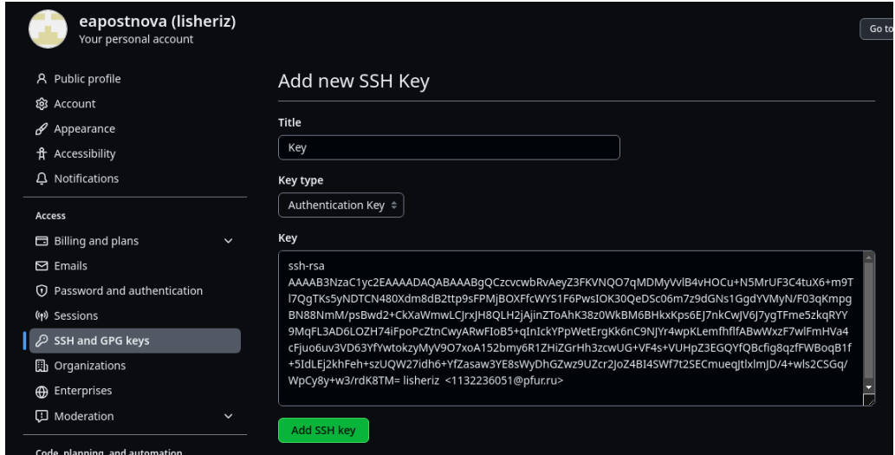

---
## Front matter
title: "Шаблон отчёта по лабораторной работе"
subtitle: "Простейший вариант"
author: "Хан цзянтао"

## Generic otions
lang: ru-RU
toc-title: "Содержание"

## Bibliography
bibliography: bib/cite.bib
csl: pandoc/csl/gost-r-7-0-5-2008-numeric.csl

## Pdf output format
toc: true # Table of contents
toc-depth: 2
lof: true # List of figures
lot: true # List of tables
fontsize: 12pt
linestretch: 1.5
papersize: a4
documentclass: scrreprt
## I18n polyglossia
polyglossia-lang:
  name: russian
  options:
	- spelling=modern
	- babelshorthands=true
polyglossia-otherlangs:
  name: english
## I18n babel
babel-lang: russian
babel-otherlangs: english
## Fonts
mainfont: PT Serif
romanfont: PT Serif
sansfont: PT Sans
monofont: PT Mono
mainfontoptions: Ligatures=TeX
romanfontoptions: Ligatures=TeX
sansfontoptions: Ligatures=TeX,Scale=MatchLowercase
monofontoptions: Scale=MatchLowercase,Scale=0.9
## Biblatex
biblatex: true
biblio-style: "gost-numeric"
biblatexoptions:
  - parentracker=true
  - backend=biber
  - hyperref=auto
  - language=auto
  - autolang=other*
  - citestyle=gost-numeric
## Pandoc-crossref LaTeX customization
figureTitle: "Рис."
tableTitle: "Таблица"
listingTitle: "Листинг"
lofTitle: "Список иллюстраций"
lotTitle: "Список таблиц"
lolTitle: "Листинги"
## Misc options
indent: true
header-includes:
  - \usepackage{indentfirst}
  - \usepackage{float} # keep figures where there are in the text
  - \floatplacement{figure}{H} # keep figures where there are in the text
---

# Цель работы

Целью работы является изучить идеологию и применение средств контроля 

версий, приобрести практические навыки по работе с системой git. 

# Задание

\1. Настройкаgithub. 

2.Базоваянастройкаgithub. 

\3. Создание SSHключа. 

\4. Сознание рабочего пространства и репозитория курса на основе шаблона. 

\5. Сознание репозитория курса на основе шаблона.

6.Настройка каталога курса.

\7. Заданиядля самостоятельной работы.

# Теоретическое введение

Системы контроля версий (VersionControlSystem, VCS) применяются при 

работе нескольких человек над одним проектом. Обычно основное дерево 

проекта хранится в локальном или удалённом репозитории, к которому 

настроен доступ для участников проекта. При внесении изменений в 

содержание проекта система контроля версий позволяет их фиксировать, 

совмещать изменения, произведённые разными участниками проекта, 

производить откат к любой более ранней версии проекта, если это требуется.

Системы контроля версий поддерживают возможность отслеживания и 

разрешения конфликтов, которые могут возникнуть при работе нескольких 

человек над одним файлом. Можно объединить (слить) изменения, сделанные 

разными участниками (автоматически или вручную), вручную выбрать 

нужную версию, отменить изменения вовсе или заблокировать файлы для 

изменения. В зависимости от настроек блокировка не позволяет другим 

пользователям получить рабочую копию или препятствует изменению 

рабочей копии файла средствами файловой системы ОС, обеспечивая таким 

образом, привилегированный доступ только одному пользователю, 

работающему с файлом.Системы контроля версий также могут обеспечивать 

дополнительные, более гибкие функциональные возможности. Например,

они могут поддерживать работу с несколькими версиями одного файла, 

сохраняя общую историю изменений до точки ветвления версий и 

собственные истории изменений каждой ветви. Кроме того, обычно доступна 

информация о том, кто из участников, когда и какие изменения вносил. 

Обычно такого рода информация хранится в журнале изменений, доступ к 

которому можно ограничить.

Система контроля версий Gitпредставляет собой набор программ командной 

строки. Доступ к ним можно получить из терминала посредством ввода 

команды gitс различными опциями. Благодаря тому, что Gitявляется 

распределённой системой контроля версий, резервную копию локального 

хранилища можно сделать простым копированием или архивацией.

# Выполнение лабораторной работы

**4.1Настройка github**

Создаюучётную запись на сайте githubи заполняюосновные данные.

{#fig:001 width=70%}

**4.2Базовая настройка git**

Делаюпредварительную конфигурацию git. Открываютерминал и ввожу 

следующие команды, указав свои имя и emailнаgithub.

{#fig:001 width=70%}

Настраиваюutf-8 в выводе сообщений git.

{#fig:001 width=70%}

Задаюимя начальной ветки.

{#fig:001 width=70%}

Задаюпараметрыautocrlfиsafecrlf.

{#fig:001 width=70%}

**4.3Создание SSHключа**

Дляпоследующей идентификации пользователя на сервере репозиториев

сгенерируюпару ключей (приватный и открытый).

{#fig:001 width=70%}

Далеезагружаюсгенерированныйоткрытый ключ. Для этого захожуна сайт

githubпод своей учётной записью и перехожув меню Setting. После этого 

выбираюв боковом меню SSHandGPGkeysи нажимаюкнопку NewSSH

key. Скопировав из локальной консоли ключ в буфер обменас помощью 

команды, 

{#fig:001 width=70%}

вставляюключ в появившееся на сайте поле и указываюдля ключа имя.

{#fig:001 width=70%}

**4.4Создание рабочего пространства и** 

**репозитория курса на основе шаблона**

Открываютерминал исоздаюкаталог для предмета «Архитектура 

компьютера».

{#fig:001 width=70%}

**4.5Создание репозитория курса на основе** 

**шаблона**

Перехожуна станицу репозитория с шаблоном курсаи выбираюUsethis 

template.В открывшемся окне задаюимя репозитория -study_2023–

2024_arhpcи создаюрепозиторий. 

{#fig:001 width=70%}

Открываютерминал,перехожув каталог курсаи клонируюсозданный 

репозиторий.

{#fig:001 width=70%}

**4.6Настройка каталога курса**

Перехожув каталог курса,удаляюлишние файлыи создаюнеобходимые 

каталоги.

{#fig:001 width=70%}

Отправляюфайлы на сервер.

{#fig:001 width=70%}

Проверяюправильность создания иерархии рабочего пространства в 

локальном репозитории и на странице github.

{#fig:001 width=70%}

{#fig:001 width=70%}

**4.7Заданиядля самостоятельной работы**

\1. Создаюотчет по выполнению лабораторной работы в соответствующем 

каталоге рабочего пространства (labs/lab02/report).

{#fig:001 width=70%}

\2. Копируюотчетпо выполнению предыдущейлабораторнойработыв 

соответствующийкаталогсозданного рабочего пространства.

{#fig:001 width=70%}

\3. Загружаюфайлы на github.

{#fig:001 width=70%}

# Выводы

По результатам данной лабораторной работы я приобрела практические 

навыки по работе с системой git, изучилаидеологиюиприменениесредств

контроляверсий. Этинавыкипомогутмневдальнейшемвработесданной

системой.

# Список литературы{.unnumbered}

::: {#refs}
::: 

\1. GDB: The GNU Project Debugger. —URL: https://www.gnu.org/software/gdb/. 

\2. GNU Bash Manual. —2016. —URL: https://www.gnu.org/software/bash/manual/. 

\3. Midnight Commander Development Center. —2021. —URL: https://midnight-commander. 

org/. 

\4. NASMAssembly Language Tutorials. —2021. —URL: https://asmtutor.com/. 

\5. Newham C. Learning the bash Shell: Unix Shell Programming. —O’Reilly Media, 2005. —

354 с. —(In a Nutshell). —ISBN 0596009658. —URL: 

http://www.amazon.com/Learningbash-Shell-Programming-Nutshell/dp/0596009658. 

\6. RobbinsA. Bash Pocket Reference. —O’Reilly Media, 2016. —156 с. —ISBN 978-

\1491941591. 

\7. The NASM documentation. —2021. —URL: https://www.nasm.us/docs.php. 

\8. Zarrelli G. Mastering Bash. —Packt Publishing, 2017. —502 с. —ISBN 9781784396879. 

\9. Колдаев В. Д., Лупин С. А. Архитектура ЭВМ. —М. : Форум, 2018. 

\10. Куляс О. Л., Никитин К. А. Курс программирования на ASSEMBLER. —М. : Солон-

Пресс, 2017. 

\11. Новожилов О. П. Архитектура ЭВМ и систем. —М. : Юрайт, 2016. 

\12. Расширенный ассемблер: NASM. —2021. —URL: 

https://www.opennet.ru/docs/RUS/nasm/. 

\13. Робачевский А., Немнюгин С., Стесик О. Операционная система UNIX. —2-еизд. —

БХВПетербург, 2010. —656 с. —ISBN978-5-94157-538-1. 

\14. Столяров А. Программирование на языке ассемблера NASMдля ОС Unix. —2-е изд. 

—М. : МАКС Пресс, 2011. —URL: http://www.stolyarov.info/books/asm_unix. 

\15. Таненбаум Э. Архитектура компьютера. —6-е изд. —СПб. : Питер, 2013. —874 с. —

(Классика ComputerScience). 

\16. Таненбаум Э., Бос Х. Современные операционные системы. —4-е изд. —СПб. : 

Питер, 2015. —1120 с. —(Классика ComputerScience).
