---
## Front matter
title: "Шаблон отчёта по лабораторной работе"
subtitle: "Простейший вариант"
author: "Хан цзянтао"

## Generic otions
lang: ru-RU
toc-title: "Содержание"

## Bibliography
bibliography: bib/cite.bib
csl: pandoc/csl/gost-r-7-0-5-2008-numeric.csl

## Pdf output format
toc: true # Table of contents
toc-depth: 2
lof: true # List of figures
lot: true # List of tables
fontsize: 12pt
linestretch: 1.5
papersize: a4
documentclass: scrreprt
## I18n polyglossia
polyglossia-lang:
  name: russian
  options:
	- spelling=modern
	- babelshorthands=true
polyglossia-otherlangs:
  name: english
## I18n babel
babel-lang: russian
babel-otherlangs: english
## Fonts
mainfont: PT Serif
romanfont: PT Serif
sansfont: PT Sans
monofont: PT Mono
mainfontoptions: Ligatures=TeX
romanfontoptions: Ligatures=TeX
sansfontoptions: Ligatures=TeX,Scale=MatchLowercase
monofontoptions: Scale=MatchLowercase,Scale=0.9
## Biblatex
biblatex: true
biblio-style: "gost-numeric"
biblatexoptions:
  - parentracker=true
  - backend=biber
  - hyperref=auto
  - language=auto
  - autolang=other*
  - citestyle=gost-numeric
## Pandoc-crossref LaTeX customization
figureTitle: "Рис."
tableTitle: "Таблица"
listingTitle: "Листинг"
lofTitle: "Список иллюстраций"
lotTitle: "Список таблиц"
lolTitle: "Листинги"
## Misc options
indent: true
header-includes:
  - \usepackage{indentfirst}
  - \usepackage{float} # keep figures where there are in the text
  - \floatplacement{figure}{H} # keep figures where there are in the text
---

# Цель работы

Целью работы является освоение процедуры оформления отчетов с помощью

легковесного языка разметки Markdown.

# Задание

1. Обновление локального репозитория.

2. Создание отчетов в формате .pdf и .docx.

3. Заполнения отчета по лабораторной работе.

4. Задание для самостоятельной работы.

# Теоретическое введение

Markdown - легковесный язык разметки, созданный с целью обозначения фор-

матирования в простом тексте, с максимальным сохранением его читаемости

человеком, и пригодный для машинного преобразования в языки для продви-

нутых публикаций. Чтобы создать заголовок, используйте знак #. Чтобы задать

для текста полужирное начертание, заключите его в двойные звездочки. Чтобы

задать для текста курсивное начертание, заключите его в одинарные звездоч-

ки. Чтобы задать для текста полужирное и курсивное начертание, заключите

его в тройные звездочки. Блоки цитирования создаются с помощью символа >.

Синтаксис Markdown для встроенной ссылки состоит из части [link text], пред-

ставляющей текст гиперссылки, и части (file-name.md) – URL-адреса или имени

файла, на который дается ссылка. Markdown поддерживает как встраивание фраг-

ментов кода в предложение, так и их размещение между предложениями в виде

отдельных огражденных блоков. Огражденные блоки кода — это простой способ

выделить синтаксис для фрагментов кода.

# Выполнение лабораторной работы

**4.1 Обновление локального репозитория**

Открываю терминал, перехожу в каталог курса, сформированный при выпол-

нении лабораторной работы №2 и обновляю локальный репозиторий, скачав

изменения из удаленного репозитория с помощью команды git pull. (рис. 4.10).

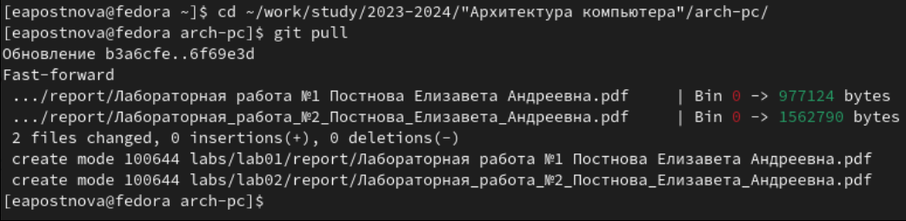{#fig:001 width=70%}

Рис. 4.1: Использование команды git pull

**4.2 Создание отчетов в формате .pdf и .docx**

Перехожу в каталог с шаблоном отчета по лабораторной работе №3 и про-

вожу компиляцию шаблона с использованием Makefile:ввожу команду make и

генерирую файлы report.pdf и report.docx. (рис. 4.10).
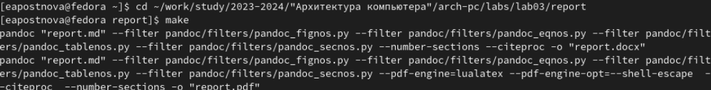{#fig:001 width=70%}

Рис. 4.2: Создание файлов с помощью команды make

Открываю файловый менеджер и проверяю корректность полученных файлов.

(рис. 4.10).

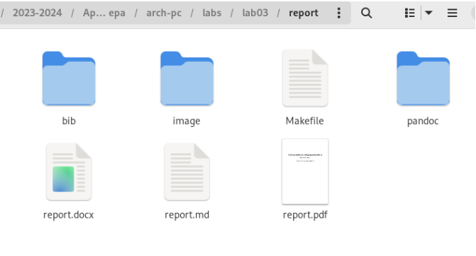{#fig:001 width=70%}

Рис. 4.3: Проверка создания отчетов

Удалите полученный файлы с помощью команды make clean. (рис. 4.10).

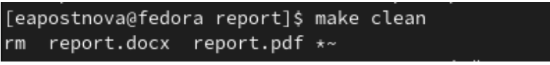{#fig:001 width=70%}

Рис. 4.4: Удаление файлов с помощью команды make clean

Проверяю, что файлы report.pdf и report.docx действительно были удалены.

(рис. 4.10).

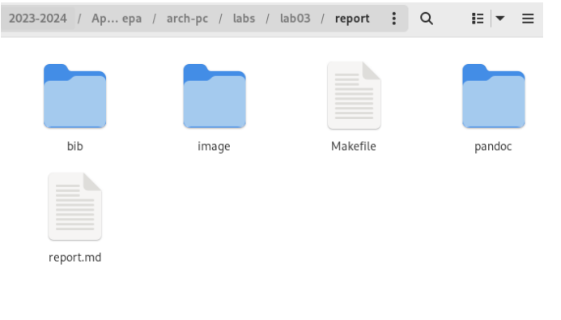{#fig:001 width=70%}

Рис. 4.5: Проверка удаления файлов

**4.3 Заполнения отчета по лабораторной работе**

С помощью текстового редактора открываю файл report.md и внимательно

изучаю его структуру, заполняю отчет. (рис. 4.10).

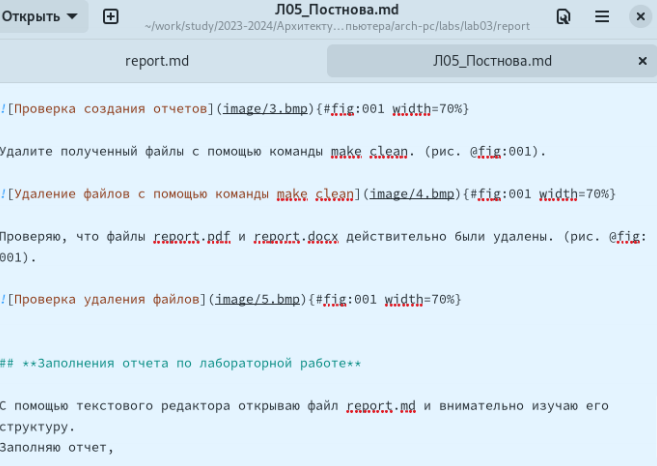{#fig:001 width=70%}

Рис. 4.6: Заполнение отчета

Компилирую отчет с использованием Makefile. (рис. 4.10).

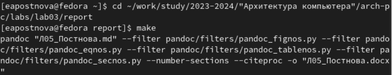{#fig:001 width=70%}

Проверяю корректность полученных файлов. (рис. 4.10).

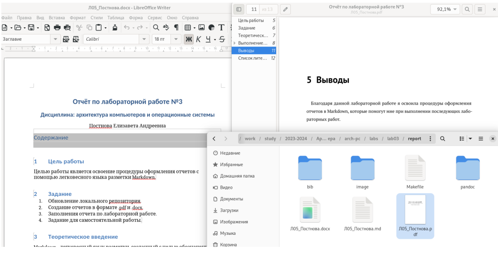{#fig:001 width=70%}

Рис. 4.7: Проверка файлов

Загружаю файлы на Github. (рис. 4.10).

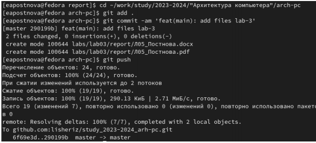{#fig:001 width=70%}

Рис. 4.8: Загрузка файлов на Gitgub

**4.4 Задание для самостоятельной работы**

1. В соответствующем каталоге делаю отчёт по лабораторной работе №2 в

формате Markdown. (рис. 4.10).

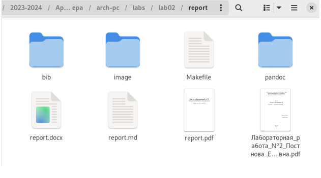{#fig:001 width=70%}

Рис. 4.9: Создание отчетов по лабораторной работе №2

2. Загружаю файлы на Github. (рис. 4.10).

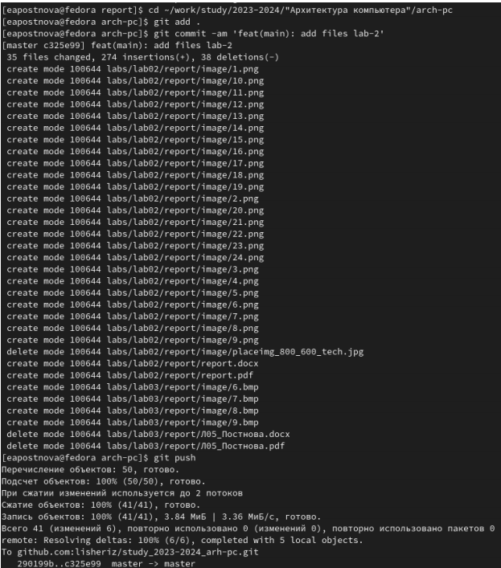{#fig:001 width=70%}

# Выводы

Благодаря данной лабораторной работе я освоила процедуры оформления

отчетов в Markdown, которые помогут мне при выполнении последующих лабо-

раторных работ.

# Список литературы{.unnumbered}

::: {#refs}

1. GDB: The GNU Project Debugger. — URL: https://www.gnu.org/software/gdb/.

2. GNU Bash Manual. — 2016. — URL: https://www.gnu.org/software/bash/manual/.

3. Midnight Commander Development Center. — 2021. — URL: https://midnight

commander. org/.

4. NASM Assembly Language Tutorials. — 2021. — URL: https://asmtutor.com/.

5. Newham C. Learning the bash Shell: Unix Shell Programming. — O’Reilly

Media, 2005. — 354 с. — (In a Nutshell). — ISBN 0596009658. — URL:

http://www.amazon.com/Learningbash-Shell-Programming-Nutshell/dp/0596009658.

6. Robbins A. Bash Pocket Reference. — O’Reilly Media, 2016. — 156 с. — ISBN

978-1491941591.

7. The NASM documentation. — 2021. — URL: https://www.nasm.us/docs.php.

8. Zarrelli G. Mastering Bash. — Packt Publishing, 2017. — 502 с. — ISBN

9781784396879.

9. Колдаев В. Д., Лупин С. А. Архитектура ЭВМ. — М. : Форум, 2018.

10. Куляс О. Л., Никитин К. А. Курс программирования на ASSEMBLER. — М. :

Солон-Пресс,

11. Новожилов О. П. Архитектура ЭВМ и систем. — М. : Юрайт, 2016.

12. Расширенный ассемблер: NASM.— 2021.—URL: https://www.opennet.ru/docs/RUS/nasm/.

13. Робачевский А., Немнюгин С., Стесик О. Операционная система UNIX. — 2-е

изд. — БХВПетербург, 2010. — 656 с. — ISBN 978-5-94157-538-1.

14. Столяров А. Программирование на языке ассемблера NASM для ОС Unix.— 2-

:::
