---
## Front matter
title: "Шаблон отчёта по лабораторной работе"
subtitle: "Простейший вариант"
author: "Хань Цзянтао"

## Generic otions
lang: ru-RU
toc-title: "Содержание"

## Bibliography
bibliography: bib/cite.bib
csl: pandoc/csl/gost-r-7-0-5-2008-numeric.csl

## Pdf output format
toc: true # Table of contents
toc-depth: 2
lof: true # List of figures
lot: true # List of tables
fontsize: 12pt
linestretch: 1.5
papersize: a4
documentclass: scrreprt
## I18n polyglossia
polyglossia-lang:
  name: russian
  options:
	- spelling=modern
	- babelshorthands=true
polyglossia-otherlangs:
  name: english
## I18n babel
babel-lang: russian
babel-otherlangs: english
## Fonts
mainfont: PT Serif
romanfont: PT Serif
sansfont: PT Sans
monofont: PT Mono
mainfontoptions: Ligatures=TeX
romanfontoptions: Ligatures=TeX
sansfontoptions: Ligatures=TeX,Scale=MatchLowercase
monofontoptions: Scale=MatchLowercase,Scale=0.9
## Biblatex
biblatex: true
biblio-style: "gost-numeric"
biblatexoptions:
  - parentracker=true
  - backend=biber
  - hyperref=auto
  - language=auto
  - autolang=other*
  - citestyle=gost-numeric
## Pandoc-crossref LaTeX customization
figureTitle: "Рис."
tableTitle: "Таблица"
listingTitle: "Листинг"
lofTitle: "Список иллюстраций"
lotTitle: "Список таблиц"
lolTitle: "Листинги"
## Misc options
indent: true
header-includes:
  - \usepackage{indentfirst}
  - \usepackage{float} # keep figures where there are in the text
  - \floatplacement{figure}{H} # keep figures where there are in the text
---

# Цель работы

Приобретение навыков написания программ с использованием подпрограмм.

Знакомство с методами отладки при помощи GDB и его основными возможно-

стями.

# Задание

1. Реализация подпрограмм в NASM.

2. Отладка программам с помощью GDB.

3. Добавление точек останова.

4. Работа с данными программы в GDB.

5. Обработка аргументов командной строки в GDB.

# Теоретическое введение

Отладка — это процесс поиска и исправления ошибок в программе. Отлад-

чики позволяют управлять ходом выполнения программы, контролировать и

изменять данные. Это помогает быстрее найти место ошибки в программе и

ускорить её исправление. Наиболее популярные способы работы с отладчиком —

это использование точек останова и выполнение программы по шагам.

GDB (GNU Debugger — отладчик проекта GNU) работает на многих UNIX-

подобных системах и умеет производить отладку многих языков програм-

мирования. GDB предлагает обширные средства для слежения и контроля за

выполнением компьютерных программ. Отладчик не содержит собственного

графического пользовательского интерфейса и использует стандартный

текстовый интерфейс консоли. Однако для GDB существует несколько сторонних

графических надстроек, а кроме того, некоторые интегрированные среды

разработки используют его в качестве базовой подсистемы отладки.

Отладчик GDB (как и любой другой отладчик) позволяет увидеть, что происхо-

дит «внутри» программы в момент её выполнения или что делает программа в

момент сбоя.

Команда run (сокращённо r) — запускает отлаживаемую программу в оболочке

GDB.

Команда kill (сокращённо k) прекращает отладку программы, после чего сле-

дует вопрос о прекращении процесса отладки. Если в ответ введено y (то есть

«да»), отладка программы прекращается. Командой run её можно начать заново,

при этом все точки останова (breakpoints), точки просмотра (watchpoints) и точки

отлова (catchpoints) сохраняются.

Для выхода из отладчика используется команда quit (или сокращённо q).

Если есть файл с исходным текстом программы, а в исполняемый файл вклю-

чена информация о номерах строк исходного кода, то программу можно отла-

живать, работая в отладчике непосредственно с её исходным текстом. Чтобы

программу можно было отлаживать на уровне строк исходного кода, она должна

быть откомпилирована с ключом -g.

Установить точку останова можно командой break (кратко b). Типичный аргу-

мент этой команды — место установки. Его можно задать как имя метки или как

адрес. Чтобы не было путаницы с номерами, перед адресом ставится «звёздочка».

Информацию о всех установленных точках останова можно вывести командой

info (кратко i).

Для того чтобы сделать неактивной какую-нибудь ненужную точку останова,

можно воспользоваться командой disable.

Обратно точка останова активируется командой enable.

Если же точка останова в дальнейшем больше не нужна, она может быть удалена

с помощью команды delete.

Для продолжения остановленной программы используется команда continue

(c). Выполнение программы будет происходить до следующей точки останова.

В качестве аргумента может использоваться целое число N, которое указывает

отладчику проигнорировать N − 1 точку останова (выполнение остановится на

N-й точке).

Команда stepi (кратко sI) позволяет выполнять программу по шагам, т.е. данная

команда выполняет ровно одну инструкцию.

Подпрограмма — это, как правило, функционально законченный участок кода,

который можно многократно вызывать из разных мест программы. В отличие от

простых переходов из подпрограмм существует возврат на команду, следующую

за вызовом. Если в программе встречается одинаковый участок кода, его можно

оформить в виде подпрограммы, а во всех нужных местах поставить её вызов. При

этом подпрограмма будет содержаться в коде в одном экземпляре, что позволит

уменьшить размер кода всей программы.

Для вызова подпрограммы из основной программы используется инструкция

call, которая заносит адрес следующей инструкции в стек и загружает в регистр

eip адрес соответствующей подпрограммы, осуществляя таким образом переход.

Затем начинается выполнение подпрограммы, которая, в свою очередь, также

может содержать подпрограммы. Подпрограмма завершается инструкцией ret,

которая извлекает из стека адрес, занесённый туда соответствующей инструк-

цией call, и заносит его в eip. После этого выполнение основной программы

возобновится с инструкции, следующей за инструкцией call.

# Выполнение лабораторной работы

**4.1 Реализация подпрограмм в NASM**

Создаю каталог для выполнения лабораторной работы № 9, перехожу в него и

создаю файл lab09-1.asm. 

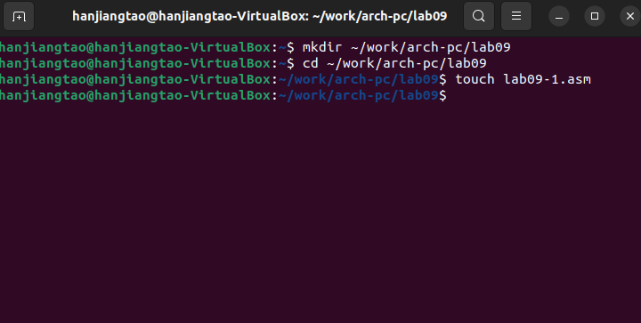{#fig:001 width=70%}

Рис. 4.1: Создание файлов для лабораторной работы

Ввожу в файл lab09-1.asm текст программы с использованием подпрограммы

из листинга 9.1.

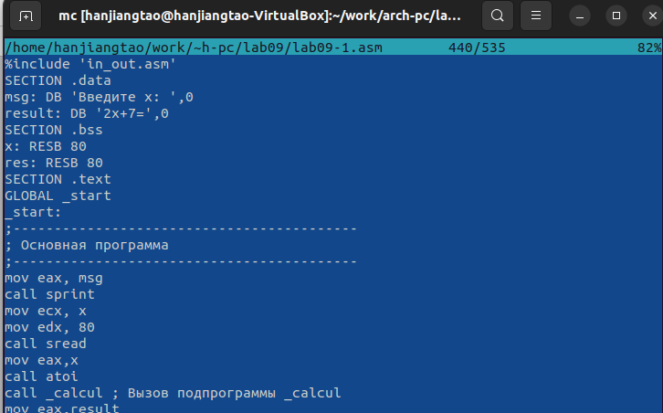{#fig:001 width=70%}

Рис. 4.2: Ввод текста программы из листинга 9.1

Создаю исполняемый файл и проверяю его работу. (рис. 4.32)

{#fig:001 width=70%}

Рис. 4.3: Запуск исполняемого файла

Изменяю текст программы, добавив подпрограмму _subcalcul в подпрограмму

_calcul для вычисления выражения f(g(x)), где x вводится с клавиатуры, f(x) = 2x +

7, g(x) = 3x − 1.

{#fig:001 width=70%}

Рис. 4.4: Изменение текста программы согласно заданию

Создаю исполняемый файл и проверяю его работу.

{#fig:001 width=70%}

Рис. 4.5: Запуск исполняемого файла

**4.2 Отладка программам с помощью GDB**

Создаю файл lab09-2.asm с текстом программы из Листинга 9.2. (рис. 4.32)

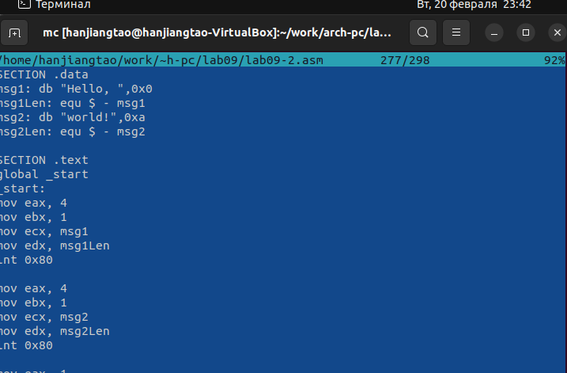{#fig:001 width=70%}

Рис. 4.6: Ввод текста программы из листинга 9.2

Получаю исполняемый файл для работы с GDB с ключом ‘-g’.

{#fig:001 width=70%}

Рис. 4.7: Получение исполняемого файла

Загружаю исполняемый файл в отладчик gdb.

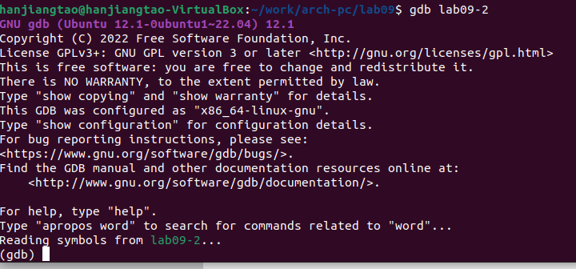{#fig:001 width=70%}

Рис. 4.8: Загрузка исполняемого файла в отладчик

Проверяю работу программы, запустив ее в оболочке GDB с помощью команды

run. 

{#fig:001 width=70%}

Рис. 4.9: Проверка работы файла с помощью команды run

Для более подробного анализа программы устанавливаю брейкпоинт на метку

_start и запускаю её. 

{#fig:001 width=70%}

Рис. 4.10: Установка брейкпоинта и запуск программы

Просматриваю дисассимилированный код программы с помощью команды

disassemble, начиная с метки _start, и переключаюсь на отображение команд с

синтаксисом Intel, введя команду set disassembly-flavor intel.

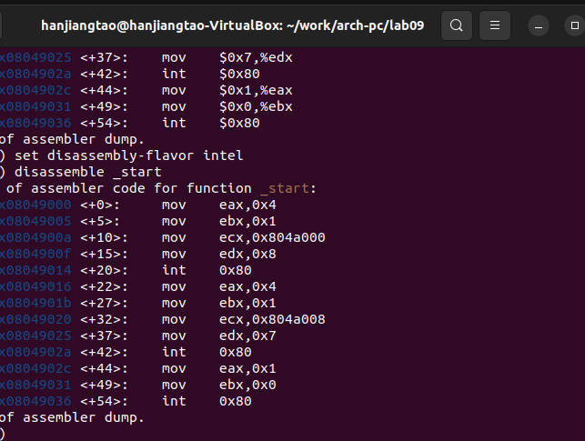{#fig:001 width=70%}

Рис. 4.11: Использование команд disassemble и disassembly-flavor intel

В режиме ATT имена регистров начинаются с символа %, а имена операндов с

$, в то время как в Intel используется привычный нам синтаксис.

Включаю режим псевдографики для более удобного анализа программы с

помощью команд layout asm и layout regs.

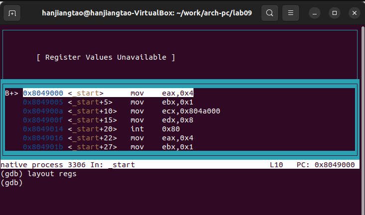{#fig:001 width=70%}

Рис. 4.12: Включение режима псевдографики

**4.2.1 Добавление точек останова**

Проверяю, что точка останова по имени метки _start установлена с помощью

команды info breakpoints и устанавливаю еще одну точку останова по адресу

инструкции mov ebx,0x0. Просматриваю информацию о всех установленных

точках останова.

{#fig:001 width=70%}

Рис. 4.13: Установление точек останова и просмотр информации о них

**4.2.2 Работа с данными программы в GDB**

Выполняю 5 инструкций с помощью команды stepi и слежу за изменением

значений регистров.

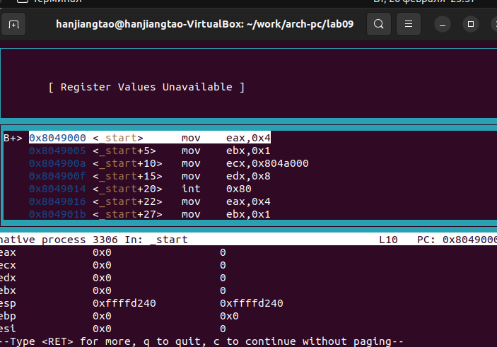{#fig:001 width=70%}

Рис. 4.14: До использования команды stepi

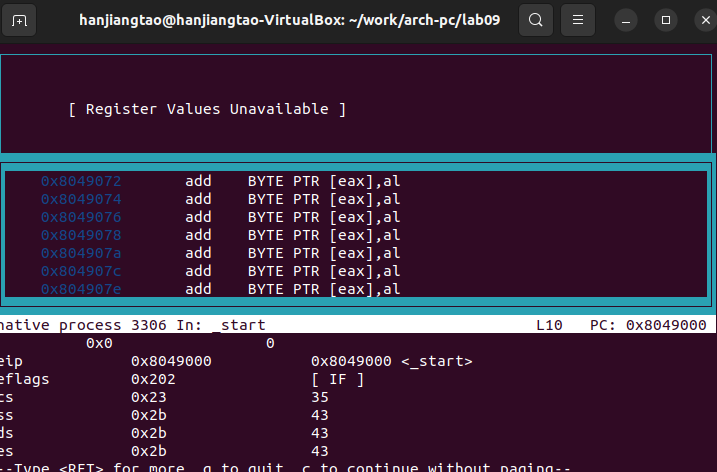{#fig:001 width=70%}

Рис. 4.15: После использования команды stepi

Изменились значения регистров eax, ecx, edx и ebx.

Просматриваю значение переменной msg1 по имени с помощью команды

x/1sb &msg1 и значение переменной msg2 по ее адресу.

{#fig:001 width=70%}

Рис. 4.16: Просмотр значений переменных

С помощью команды set изменяю первый символ переменной msg1 и заменяю

первый символ в переменной msg2.

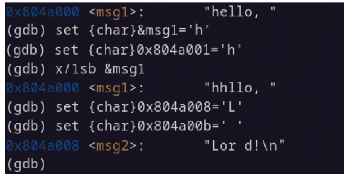{#fig:001 width=70%}

Рис. 4.17: Использование команды set

Вывожу в шестнадцатеричном формате, в двоичном формате и в символьном

виде соответственно значение регистра edx с помощью команды print p/F $val.

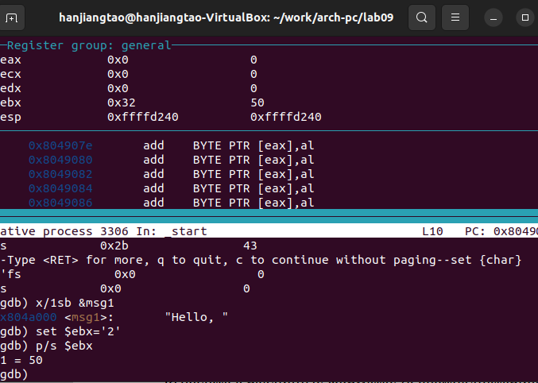{#fig:001 width=70%}

Рис. 4.18: Вывод значения регистра в разных представлениях

С помощью команды set изменяю значение регистра ebx в соответствии с

заданием.

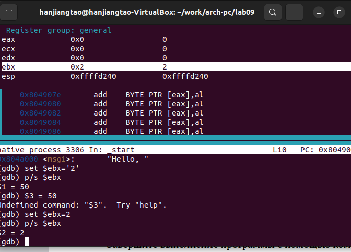{#fig:001 width=70%}

Рис. 4.19: Использование команды set для изменения значения регистра

Разница вывода команд p/s $ebx отличается тем, что в первом случае мы пере-

водим символ в его строковый вид, а во втором случае число в строковом виде

не изменяется.

Завершаю выполнение программы с помощью команды continue и выхожу из

GDB с помощью команды quit.

{#fig:001 width=70%}

Рис. 4.20: Завершение работы GDB

**4.2.3 Обработка аргументов командной строки в GDB**

Копирую файл lab8-2.asm с программой из листинга 8.2 в файл с именем lab09-

3.asm и создаю исполняемый файл. 

{#fig:001 width=70%}

Рис. 4.21: Создание файла

Загружаю исполняемый файл в отладчик gdb, указывая необходимые аргумен-

ты с использованием ключа –args.

{#fig:001 width=70%}

Рис. 4.22: Загрузка файла с аргументами в отладчик

Устанавливаю точку останова перед первой инструкцией в программе и запус-

каю ее. 

{#fig:001 width=70%}

Посматриваю вершину стека и позиции стека по их адресам.

{#fig:001 width=70%}

Рис. 4.24: Просмотр значений, введенных в стек

Шаг изменения адреса равен 4, т.к количество аргументов командной строки

равно 4.

## **Выводы**

Во время выполнения данной лабораторной работы я приобрела навыки на-

писания программ с использованием подпрограмм и ознакомилась с методами

отладки при помощи GDB и его основными возможностями.

# Список литературы{.unnumbered}

::: {#refs}

1. GDB: The GNU Project Debugger. — URL: https://www.gnu.org/software/gdb/.

2. GNU Bash Manual. — 2016. — URL: https://www.gnu.org/software/bash/manual/.

3. Midnight Commander Development Center. — 2021.— URL: https://midnight

commander. org/.

4. NASM Assembly Language Tutorials. — 2021. — URL: https://asmtutor.com/.

5. Newham C. Learning the bash Shell: Unix Shell Programming. — O’Reilly 

Media, 2005. — 354 с. — (In a Nutshell). — ISBN 0596009658. — URL:

http://www.amazon.com/Learningbash-Shell-Programming-Nutshell/dp/0596009658.

6. Robbins A. Bash Pocket Reference. — O’Reilly Media, 2016. — 156 с. — ISBN 

978-1491941591.

7. The NASM documentation. — 2021. — URL: https://www.nasm.us/docs.php.

8. Zarrelli G. Mastering Bash. — Packt Publishing, 2017. — 502 с. — ISBN 

9781784396879.

9. Колдаев В. Д., Лупин С. А. Архитектура ЭВМ. — М. : Форум, 2018.

10. Куляс О. Л., Никитин К. А. Курс программирования на ASSEMBLER. — М. : 

Солон-Пресс, 2017.

11. Новожилов О. П. Архитектура ЭВМ и систем.— М. : Юрайт, 2016.

12. Расширенный ассемблер: NASM.— 2021.— URL: https://www.opennet.ru/docs/RUS/nasm/.

13. Робачевский А., Немнюгин С., Стесик О. Операционная система UNIX.— 2-е 

изд. — БХВПетербург, 2010. — 656 с. — ISBN 978-5-94157-538-1.

14. Столяров А. Программирование на языке ассемблера NASM для ОС Unix.— 2-

е изд.— М.: МАКС Пресс, 2011.— URL: http://www.stolyarov.info/books/asm_unix.:::
