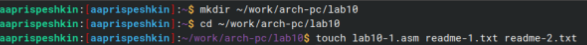
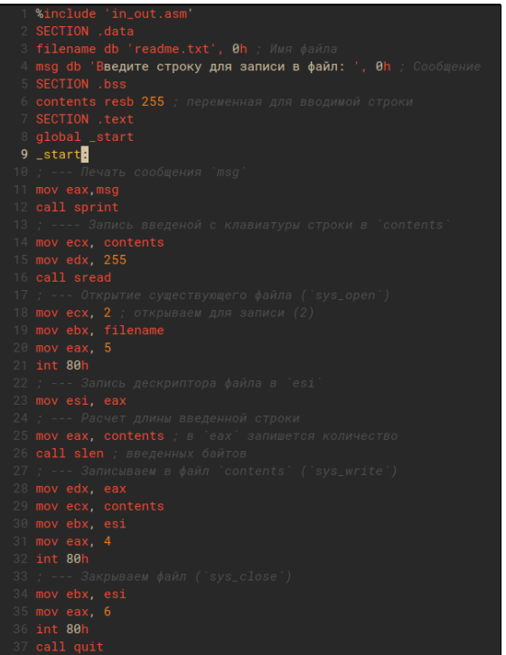
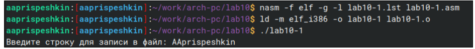
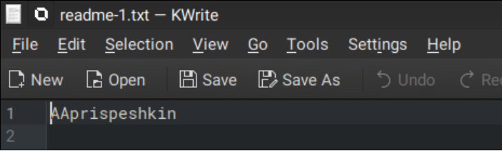
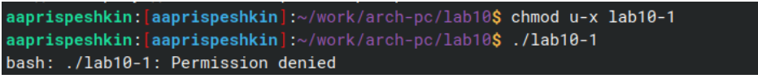
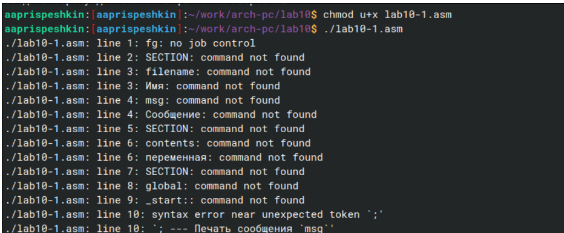
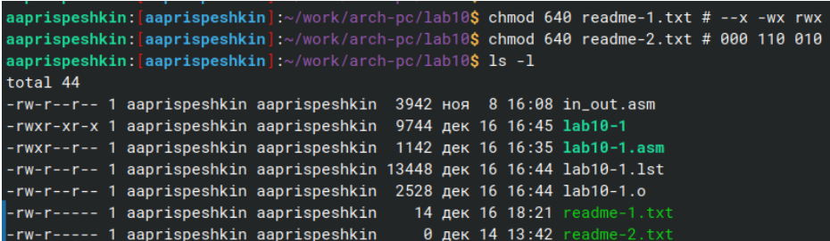
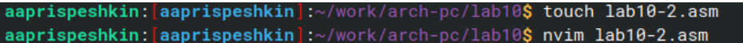
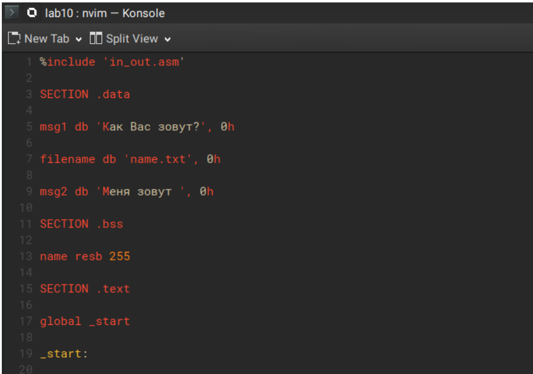
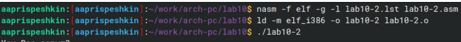

---
## Front matter
title: "Лабораторная работа №10"
subtitle: "Работа с файлами средставми NASM"
author: "Хань Цзянтао"

## Generic otions
lang: ru-RU
toc-title: "Содержание"

## Bibliography
bibliography: bib/cite.bib
csl: pandoc/csl/gost-r-7-0-5-2008-numeric.csl

## Pdf output format
toc: true # Table of contents
toc-depth: 2
lof: true # List of figures
lot: true # List of tables
fontsize: 12pt
linestretch: 1.5
papersize: a4
documentclass: scrreprt
## I18n polyglossia
polyglossia-lang:
  name: russian
  options:
	- spelling=modern
	- babelshorthands=true
polyglossia-otherlangs:
  name: english
## I18n babel
babel-lang: russian
babel-otherlangs: english
## Fonts
mainfont: PT Serif
romanfont: PT Serif
sansfont: PT Sans
monofont: PT Mono
mainfontoptions: Ligatures=TeX
romanfontoptions: Ligatures=TeX
sansfontoptions: Ligatures=TeX,Scale=MatchLowercase
monofontoptions: Scale=MatchLowercase,Scale=0.9
## Biblatex
biblatex: true
biblio-style: "gost-numeric"
biblatexoptions:
  - parentracker=true
  - backend=biber
  - hyperref=auto
  - language=auto
  - autolang=other*
  - citestyle=gost-numeric
## Pandoc-crossref LaTeX customization
figureTitle: "Рис."
tableTitle: "Таблица"
listingTitle: "Листинг"
lofTitle: "Список иллюстраций"
lotTitle: "Список таблиц"
lolTitle: "Листинги"
## Misc options
indent: true
header-includes:
  - \usepackage{indentfirst}
  - \usepackage{float} # keep figures where there are in the text
  - \floatplacement{figure}{H} # keep figures where there are in the text
---

# Цель работы
Приобретение навыков написания программ для работы с файлами

# Задание

1. Написание программ для работы с файлами.

2. Задание для самостоятельной работы.

# Выполнение лабораторной работы

Создадим каталог для программ лабораторной работы № 10, перехожу в него и
создадим файлы lab10-1.asm, readme-1.txt и readme-2.txt. 
{#fig:001 width=70%}

Введём в файл lab10-1.asm текст программы, записывающей в файл сообщения, из листинга 10.1. 

{#fig:001 width=70%}

Создадим исполняемый файл и проверяю его работу. 

{#fig:001 width=70%}

Проверим правильность выполнения программы

{#fig:001 width=70%}

Далее с помощью команды chmod u-х изменим права доступа к исполняемому файлу lab10-1,
запретив его выполнение и попытаемся выполнить файл. 

{#fig:001 width=70%}

Файл не выполняется, т.к в команде мы указали "u" - владелец , "-" - отменить набор прав, "х" - право на исполнение.

С помощью команды chmod u+х изменим права доступа к файлу lab10-1.asm с исходным текстом программы, добавив права на исполнение, и попытаемся выполнить его. 

{#fig:001 width=70%}

Текстовый файл начинает исполнение, но не исполняется, т.к не содержит в себе команд для терминала.

В соответствии со своим вариантом (1) в таблице 10.4 предоставляем права доступа к файлу readme1.txt представленные в символьном виде, а для файла readme-2.txt – в двочном виде:

--x -wx rwx 000 110 010

И проверим правильность выполнения с помощью команды ls -l. 

{#fig:001 width=70%}

Создадим файл lab10-2.asm и откроем его в текстовом редакторе neovim

{#fig:001 width=70%}

Запишем код программы, выводящей приглашения “Как Вас зовут?”, считывающей с клавиатуры фамилию и имя и создающую файл, в который записывается сообщение “Меня зовут: ”. 

{#fig:001 width=70%}

Создадим исполняемый файл и проверим его работу. Проверим наличие файла и его содержимое с помощью команд ls и cat. 

{#fig:001 width=70%}

# Выводы

В результате данной лабораторной работы я научился работать с файлами средствами языка программирования NASM

# Список литературы{.unnumbered}

[Лабораторная работа №10](https://esystem.rudn.ru/pluginfile.php/2089097/mod_resource/content/0/%D0%9B%D0%B0%D0%B1%D0%BE%D1%80%D0%B0%D1%82%D0%BE%D1%80%D0%BD%D0%B0%D1%8F%20%D1%80%D0%B0%D0%B1%D0%BE%D1%82%D0%B0%20%E2%84%9610.%20%D0%A0%D0%B0%D0%B1%D0%BE%D1%82%D0%B0%20%D1%81%20%D1%84%D0%B0%D0%B9%D0%BB%D0%B0%D0%BC%D0%B8%20%D1%81%D1%80%D0%B5%D0%B4%D1%81%D1%82%D0%B2%D0%B0%D0%BC%D0%B8%20Nasm.pdf)
